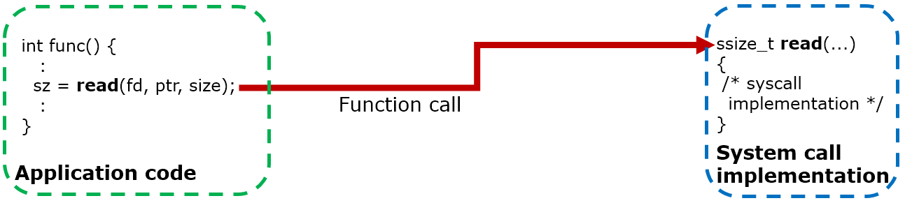

NuttX Task Tracer Internals
===========================

# Overview

The Task Tracer is constructed by the following functions.

## Trace event collection
- The trace event is collected by calling the extended sched_note_*() APIs.

  - sched_note_start()
  - sched_note_stop()
  - sched_note_suspend()
  - sched_note_resume()
    - Existing APIs to get the task start/stop/switching
  - sched_note_syscall_enter()
  - sched_note_syscall_leave()
    - New APIs to get enter/leave system call
  - sched_note_irqhandler()
    - New APIs to get enter/leave interrupt handler

## Trace data management
- File: sched/sched_tracer.c
- The sched_note_*() APIs are implemented here.
- Generate the trace event entry and accumulate it into the task trace buffer.
- The trace event entry is recorded as the packed format (struct tracer_packed_*).

## Trace device driver
- File: drivers/syslog/tracer_driver.c
- `/dev/tracer` device driver.
- Read the trace event entry from the trace buffer by the user request.
- The trace event entry is recorded as the unpacked format (struct tracer_*).

## NuttShell trace command
- File: nshlib/nsh_trace.c
- NuttShell `trace` command handler.
- Read the unpacked trace event from `/dev/tracer` and convert into the ftrace text format which is acceptable by "Trace Compass"

# Getting the system call trace events

To get the system call trace events, two different methods are used for PROTECTED/KERNEL build and FLAT build.

## PROTECTED/KERNEL build

In PROTECTED and KERNEL build, the system call issued by the user space is handled as the following steps.

- System call issued by the application code is handled by the system call proxy (automatically generated by mksyscall).
- System call proxy issues the supervisor call instruction to enter into the kernel space.
- System call handler in the kernel space calls the system call stub (automatically generated by mksyscall).
- System call stub calls the API implementation in the NuttX kernel.

To get the system call trace, fix mksyscall tool to insert the system call enter/leave hook in the system call stub like the following figure.

## FLAT build

Different to PROTECTED and KERNEL build, the system call is just a function call into the NuttX kernel in FLAT build.

To get the system call trace, [wrapper function option](https://sourceware.org/binutils/docs-2.34/ld/Options.html#index-_002d_002dwrap_003dsymbol) of the GNU Linker is used.

Fix mksyscall tool to generate the system call wrapper which call system call enter/leave hook.
It is superseded by the system call function call in the application code by passing `--wrap` linker option to the build system.

