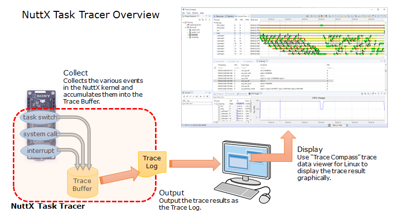

NuttX Task Tracer
=================

# Overview

NuttX Task Tracer is the tool to collect the various events in the NuttX kernel and display the result graphically.

It can collect the following events.

- Task execution, termination, switching
- System call enter/leave
- Interrupt handler enter/leave

# [User Guide](NuttXTaskTracer.md)

# [Internals](NuttXTaskTracerInternals.md)

